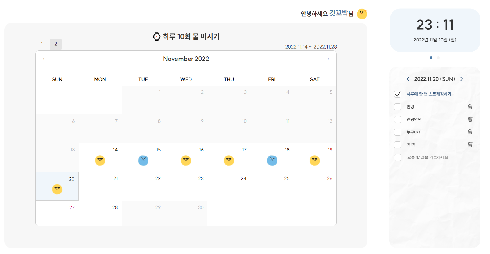
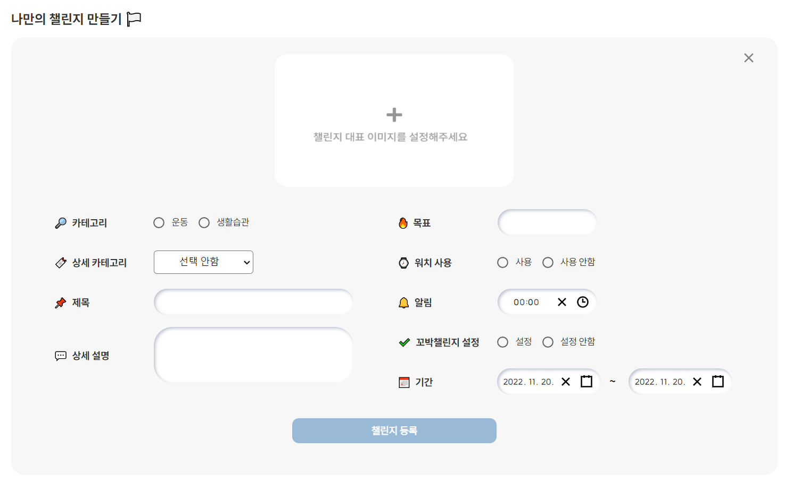
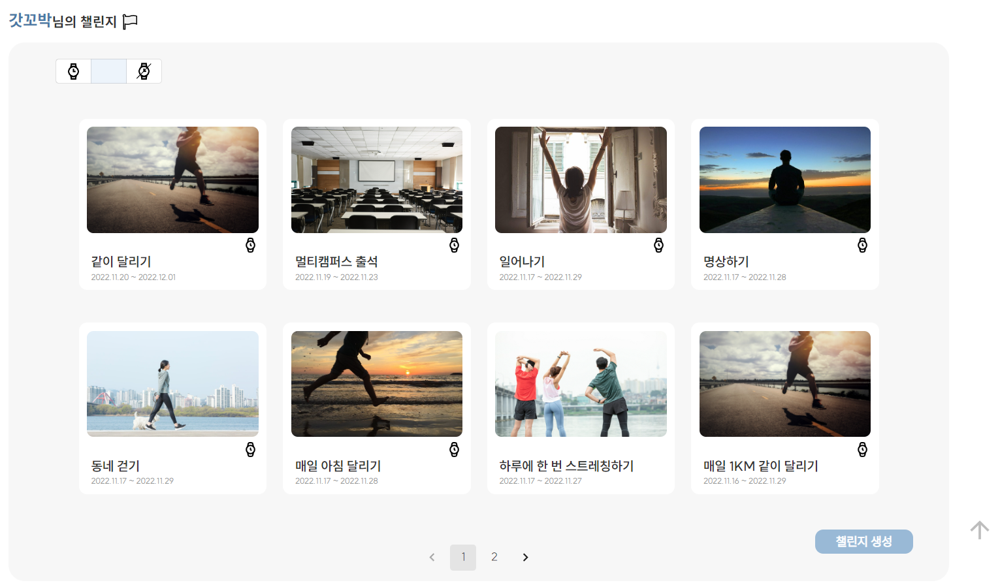
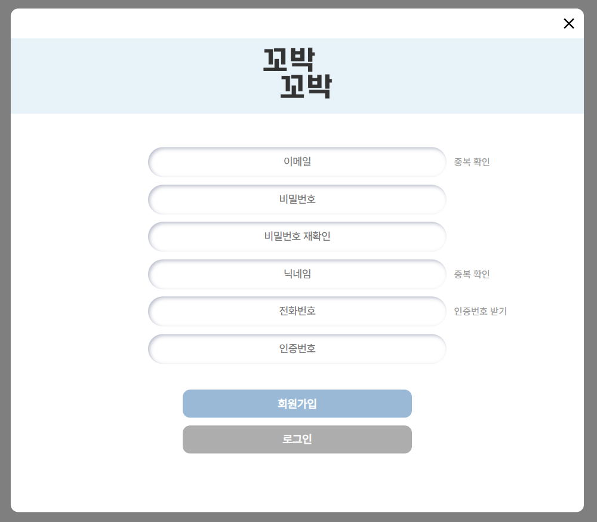
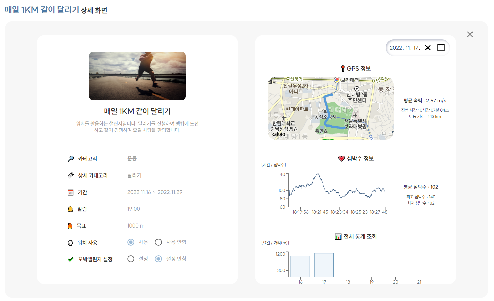
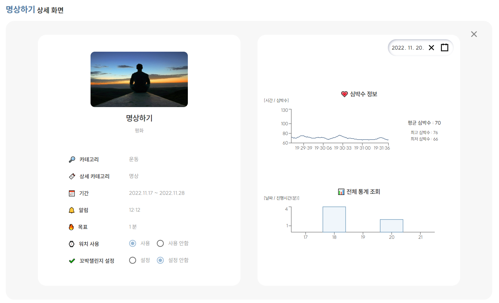
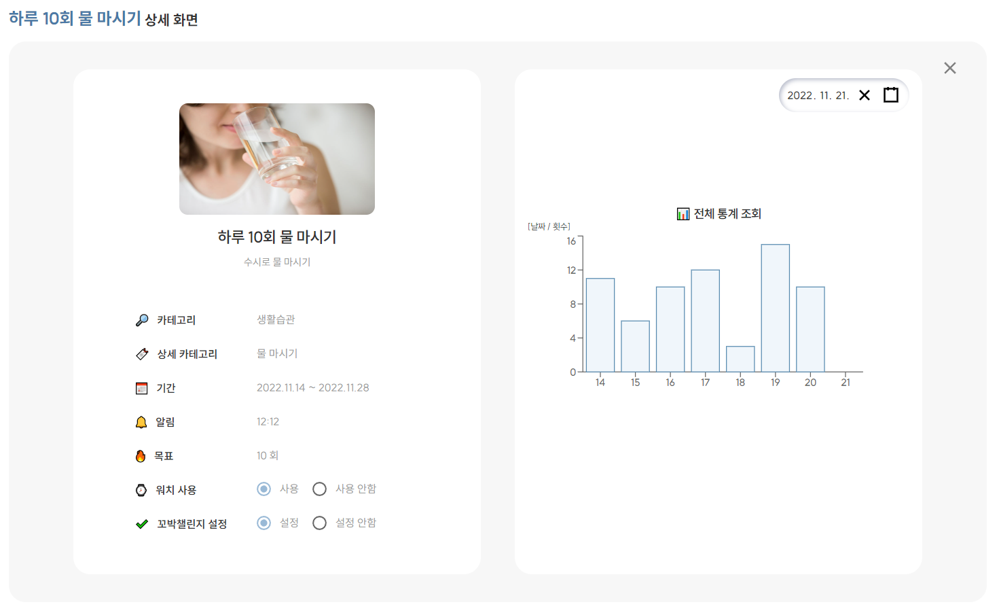
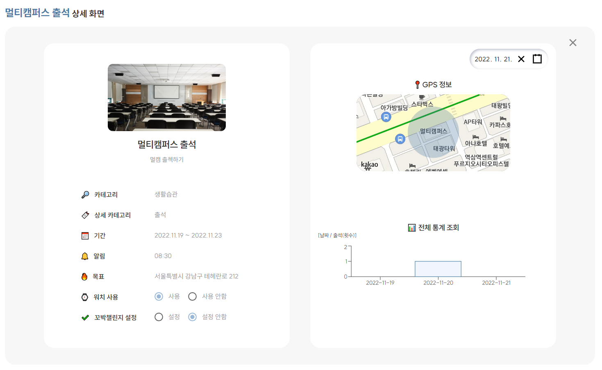
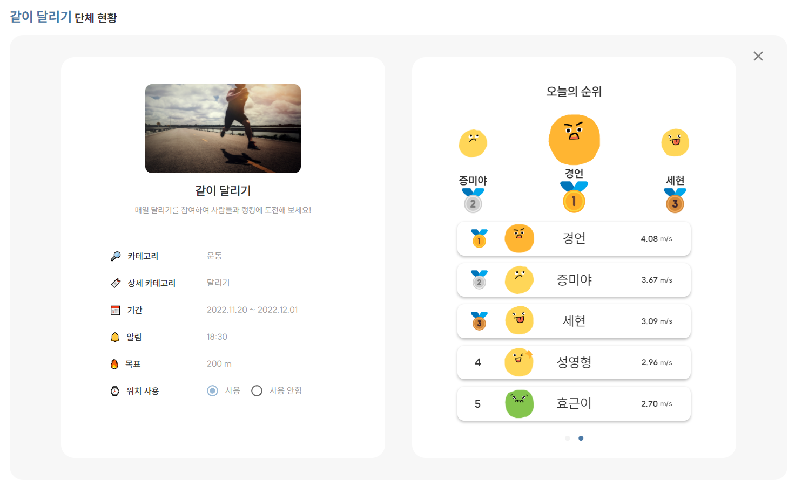

## KKOBAK README (프론트엔드 Ver.)

---

- 프론트 포팅 매뉴얼
  
  - 웹 (React)
  
  - 크롬 익스텐션

- 폴더 구조

- React
  
  - Front-End 기술스택 및 라이브러리
  
  - 컴포넌트 구조

- 기능 
  
  - 메인 화면
  
  - 챌린지 생성 화면
  
  - 내 챌린지 화면
  
  - 회원가입 화면
  
  - 챌린지 주요 통계 화면
    
    - 운동 - 달리기 화면
    
    - 운동 - 명상 화면
    
    - 생활습관 - 물 마시기 화면
    
    - 생활습관 - 출석 화면
  
  - 단체 통계 화면

---

#### 프론트 포팅 매뉴얼

##### 1. 웹

- node.js 16.18.0 LTS 설치
  
  - (npm -v 8.19.2)

- git clone 진행

- .env 생성 (생성 위치는 아래 폴더구조 확인 : frontend>kkobak안 위치에 생성하기)
  
  - .env 안에 들어가야 하는 정보
    
    - REACT_APP_KAKAOMAP_API={발급받은 키}
    
    - REACT_APP_KAKAO_REST_API={발급받은 키}
    
    - REACT_APP_OPENWEATHERMAP_API={발급받은 키}

- `npm i`를 통해 설치 (설치 위치는 아래 폴더구조 확인 : frontend>kkobak안 위치)

- `npm start`를 통해 로컬에서 실행가능

##### 2. 크롬 익스텐션

- `npm run build` 실행을 통해 build 폴더 생성 (생성 위치는 아래 폴더구조 확인 : frontend>kkobak안 위치)
- 크롬 확장 프로그램에서 개발자 모드를 실행
  - 해당 build 파일을 `압축해제된 확장 프로그램을 로드합니다.`통해 로컬에서 실행가능
  - `확장 프로그램 압축`을 통해 해당 build 파일을 압축하여 웹 스토어에 배포 진행.

---

#### 폴더 구조

- frontend
  
  - kkobak
    
    - public
      
      - images
      
      - KKOBAK.html
      
      - favicon.ico
      
      - go.js
      
      - index.html
      
      - manifest.json
      
      - robots.txt
    
    - src
      
      - api
      
      - component
        
        - atom
        
        - module
        
        - page
      
      - configs
      
      - helper
      
      - static
      
      - App.css
      
      - App.js
      
      - App.test.js
      
      - index.css
      
      - index.js
    
    - .gitignore
    
    - Dockerfile
    
    - README.md
    
    - jsconfig.json
    
    - package-lock.json
    
    - package.json
    
    - .env
    
    - build
    
    - node_modules

---

#### React

##### Front-End 기술스택 및 라이브러리

- 핵심 라이브러리 및 기술 스택
  
  | 라이브러리 | Version | Comment |
  | ----- | ------- | ------- |
  |       |         |         |

##### 컴포넌트 구조

- 아토믹 디자인 패턴 활용
  
  : 화학적 관점에서 영감을 얻은 디자인 시스템입니다. 단계별로 추상적인 것에서 구체화하는 단계를 통해 컴포넌트를 개발합니다.
  
  

- 기존 아토믹 디자인 패턴을 참고하여 atom, module, page로 구성하는 컴포넌트 구조를 진행했습니다.
  
  : 페이지 기획 및 설계를 통해 프로젝트 규모를 파악하여 컴포넌트 단위를 구별했으며 프론트 팀에서 같이 atom, module, page를 구분하여 개발을 진행했습니다.

##### 기능 소개

###### 메인 화면

- 캘린더를 통해 일자별 챌린지 달성 여부 조회
  
  - 챌린지 달성 여부 체크

- 유저 정보
  
  - 프로필 수정
  
  - 로그아웃

- Todo
  
  - Todo 리스트 작성
  
  - Todo 리스트 조회
  
  - 캘린더 Todo 연결

- 위젯
  
  - 현재 시간과 요일 별 날씨 제공

###### 챌린지 생성 화면

- 챌린지 이미지 추가

- 카테고리 설정
  
  - 운동, 생활습관에 따라 상세 카테고리 구분
  
  - 상세카테고리 설정
    
    - 운동 : 달리기, 걷기, 명상, 기타
    
    - 생활습관 : 물 마시기, 영양제 먹기, 일어서기, 출석, 기타
  
  - 제목, 상세 설명 설정
  
  - 목표 설정
    
    - 해당 카테고리 별 적합한 단위 적용
  
  - 워치 사용
    
    - 챌린지 조회에서 리스트 필터 기능 및 챌린지 진행 가능 여부 판단
  
  - 알림
    
    - 해당 챌린지 이용을 위한 알림
  
  - 꼬박챌린지 설정
    
    - 메인화면 캘린더 등록을 위한 설정
  
  - 기간

###### 내 챌린지 화면

- 챌린지 조회

- 챌린지 생성

- 페이지네이션

- 워치 유무 판단

###### 회원가입 화면

- 이메일 중복 확인

- 닉네임 중복 확인

- 전화번호 인증 번호 진행

###### 챌린지 주요 통계 화면

- 운동 - 달리기 화면
  
  
  
  - 챌린지 생성에서 입력한 정보 제공
  
  - GPS를 통해 이동거리 표시
  
  - 심박수 표시
  
  - 일별 이동 거리 표시
  
  - 해당 요일 이동

- 운동 - 명상 화면
  
  
  
  - 챌린지 생성에서 입력한 정보 제공
  
  - 심박수 표시
  
  - 일별 진행 시간 표시
  
  - 해당 요일 이동

- 생활습관 - 물 마시기 화면
  
  
  
  - 챌린지 생성에서 입력한 정보 제공
  
  - 일별 진행 횟수 표시

- 생활습관 - 출석 화면
  
  
  
  - 챌린지 생성에서 입력한 정보 제공
  
  - 해당 목적지 위치 제공
  
  - 일별 진행 횟수 표시

###### 단체 통계 화면

- 단체 챌린지 참가한 유저 제공

- 유저별 당일 랭킹 제공
